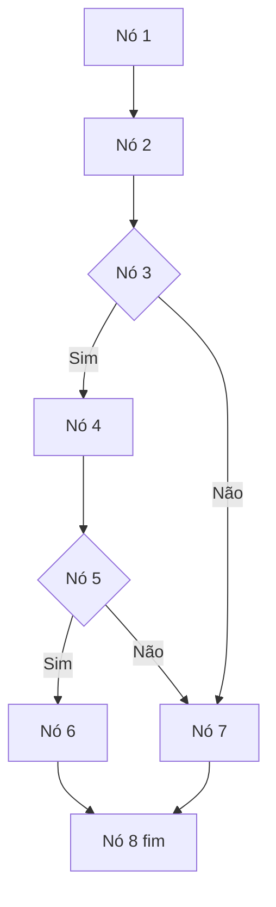

# Teste de Caixa Branca

# **Etapa1: Erros encontrados no código**
### 1 - Função Connection conectarBD() :
A função esta dentro da classe User o que é uma prática ruim pois são contextos diferentes, ela deveria estar separada em outro arquivo como um ConnectionFactory. 

### 2 - Classe do driver JDBC :
A classe chamada na linha 12 não existe, o certo seria `com.mysql.cj.jdbc.Driver`. Também podemos ver que o comando `.newInstance()` foi deprecado desde a versão 9 do Java. Caso esteja utilizando versões superiores este comando deveria ser removido.

Sugestão: `Class.forName("com.mysql.cj.jdbc.Driver");`

### 3 - URL de conexão com o banco :

Na url de conexão não foi especificada a porta de conexão com o banco de dados na URL, parâmetros essenciais como useSSL e serverTimezone

Sugestão: `jdbc:mysql://localhost:3306/empresa?user=lopes&password=123&useSSL=false&serverTimezone=UTC`

### 4 - Tratamento de exceções :

Podemos ver que nas linhas 15 e 33 foi omitido o tratamento dos erros, dificultando a identificação de erros. Além disso o Exception é muito genérico, e geralmente uma prática melhor seria te um tratamento mais preciso e informativo dos erros

Sugestão:
```
catch (SQLException e) {
            System.out.println("Erro ao conectar: " + e.getMessage());
        }
```


### 5 - Uso inadequado de váriavel global :

Ao definir uma variável como "public", ela pode ser acessada e modificada diretamente por outras classes do sistema, o que pode comprometer a integridade e o controle sobre os dados. 

O ideal seria definir a variável como private, caso seja necessário acessá-la ou modificá-la fora da classe seriam usandos métodos específicos como getters e setters, garantindo um controle mais seguro sobre seu uso e evitando alterações indesejadas.
Sugestão:
```
 private String nome = "";
 private boolean result = false;

public String getNome() {
        return nome;
    }

    public void setNome(String nome) {
        this.nome = nome;
    }

 public boolean isResult() {
        return result;
    }

    public void setResult(boolean result) {
        this.result = result;
    }
```

### 6 - Vulnerabilidade a MySQL Injection :

A String "Sql" definida na linha 20 e preenchida posteriormente pode ser vulnerável a comandos maliciosos inseridos pelo usuário.
Uma abordagem mais recomendada seria a utilização de "PreparedStatement". Este recurso possibilita a inserção de parâmetros de forma segura, evitando a concatenação de valores diretamente na string de consulta.

Sugestão:
```
String sql = "SELECT nome FROM usuarios WHERE login = ? AND senha = ?";
PreparedStatement pstmt = conn.prepareStatement(sql)) {
        pstmt.setString(1, login);
        pstmt.setString(2, senha);
  try (ResultSet rs = pstmt.executeQuery()) {
            if (rs.next()) {
                result = true;
                nome = rs.getString("nome");
            }
        }
```

### 7 - Conexão sem Fechamento :

Os recursos "Connection" não esta sendo fechados corretamente. Isso é necessário para garantir que os recursos sejam liberados corretamente e evitar vazamentos de memória.

Sugestão: ` conn.close();`

### 8 - Tratamento de erro em "verificarUsuario"  :

A função "verificarUsuario" retorna false por padrão, pois não esta tratando novamente os erros.
```
catch (Exception e) {
    // Trata qualquer erro de forma genérica
    System.err.println("Erro: " + e.getMessage());
    e.printStackTrace();
}
```

# **Etapa2: Complexidade Ciclomática**
O código foi modificado para identificar os nós atravéz de comentários

Abaixo encontramos o fluxo de como cada nó se conecta:

### Cálculo:
```
M = E - N + 2P
M = 9 − 8 +2 ×1 = 3
```
A complexidade ciclomática M desse código é 3.

### Caminhos:
C1 => 1, 2, 3, 4, 5, 6, 8

C2 => 1, 2, 3, 4, 5, 7, 8

C3 => 1, 2, 3, 7, 8

